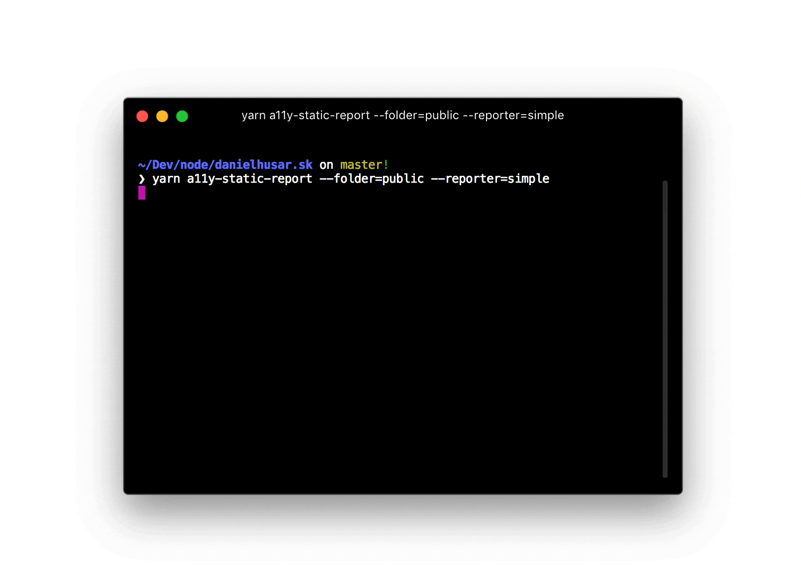

# a11y-static-report [](https://travis-ci.org/danielhusar/a11y-static-report)
> Run accessibility report on static pages via [axe-core](https://github.com/dequelabs/axe-core)



## How it works

It starts the static webserver and look up for all `html` files inside of it. From the html files we generate routes and use them as input for [a11y-report](https://github.com/danielhusar/a11y-report).

## Install

```sh
yarn add --dev @daniel.husar/a11y-static-report
```
or
```sh
npm install --dev @daniel.husar/a11y-static-report
```

## Usage

```js
import a11yStaticReport from '@daniel.husar/a11y-static-report';

(async () => {
  await a11yStaticReport({
    folder: 'public',
  });
})();
```

## API

### a11yStaticReport(config)

Prints accessibility report with logger function and returns promise that resolves for not errors or reject if there is any error.

#### config

| Property        | Type                      | Default   | Description |
| :---------------| :------------------------ | :---------| :---------- |
| `port`          | `number`                  | `9001`    | Port on which static server will start. |
| `folder`        | `string`                  | `public`  | Folder with static files to serve. |
| `excludeFiles`  | `array<string∣RegExp>` | `[]`      | Array of files to ignore. Could be string or RegExp. Example `['blog/index.html', /^de\/blog/]` |
| `debug`         | `boolean`                 | `false`   | Prints debug messages. |

Every other option that you pass, will be forwarded into [a11y-report](https://github.com/danielhusar/a11y-report#config).

## Cli

```sh
yarn add --dev @daniel.husar/a11y-static-report
yarn a11y-static-report --folder=out
```

For more complex config options you can use `.a11yrc` file in the root of your project:

`.a11yrc`
```js
module.exports = {
  port: 9001,
  folder: 'out',
  reporter: 'simple'
}
```

## License
MIT
